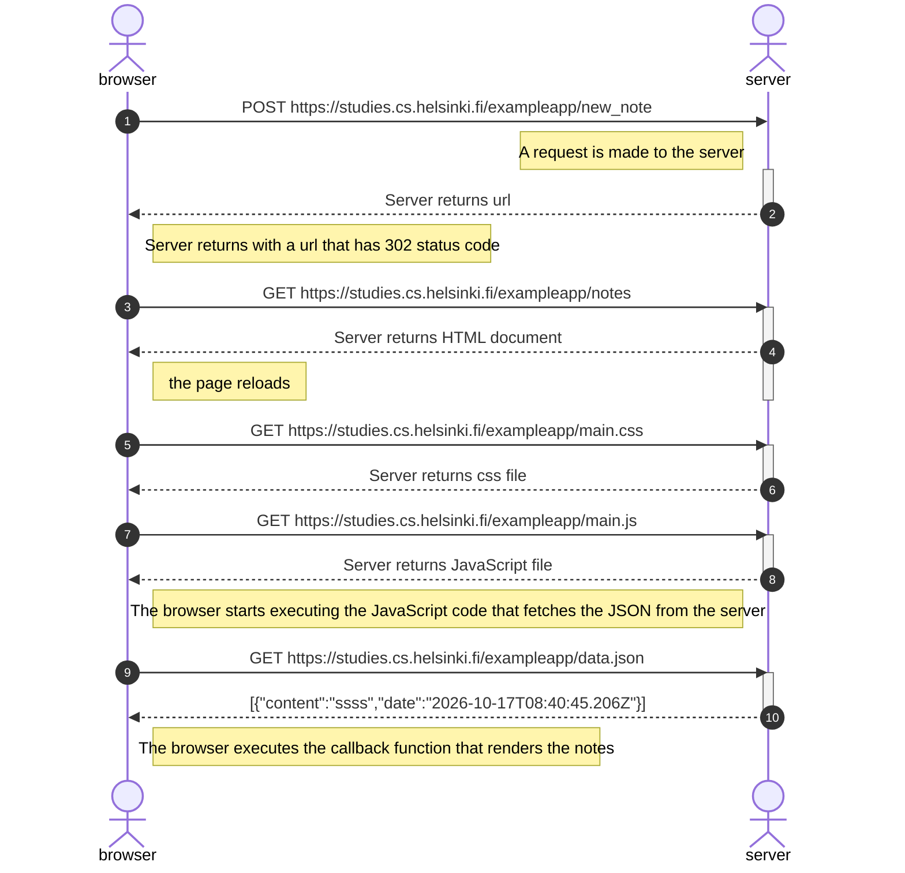

```mermaid
sequenceDiagram
    autonumber
    actor browser
    actor server

    browser->>server: POST https://studies.cs.helsinki.fi/exampleapp/new_note
    Note left of server: A request is made to the server
    activate server
    server-->>browser: Server returns url
    deactivate server
    Note right of browser: Server returns with a url that has 302 status code

    browser->>server: GET https://studies.cs.helsinki.fi/exampleapp/notes
    activate server
    server-->>browser: Server returns HTML document
    Note right of browser: the page reloads
    deactivate server

    browser->>server: GET https://studies.cs.helsinki.fi/exampleapp/main.css
    activate server
    server-->>browser: Server returns css file
    deactivate server

    browser->>server: GET https://studies.cs.helsinki.fi/exampleapp/main.js
    activate server
    server-->>browser: Server returns JavaScript file
    deactivate server

    Note right of browser: The browser starts executing the JavaScript code that fetches the JSON from the server

    browser->>server: GET https://studies.cs.helsinki.fi/exampleapp/data.json
    activate server
    server-->>browser: [{"content":"ssss","date":"2026-10-17T08:40:45.206Z"}]
    deactivate server

    Note right of browser: The browser executes the callback function that renders the notes
```