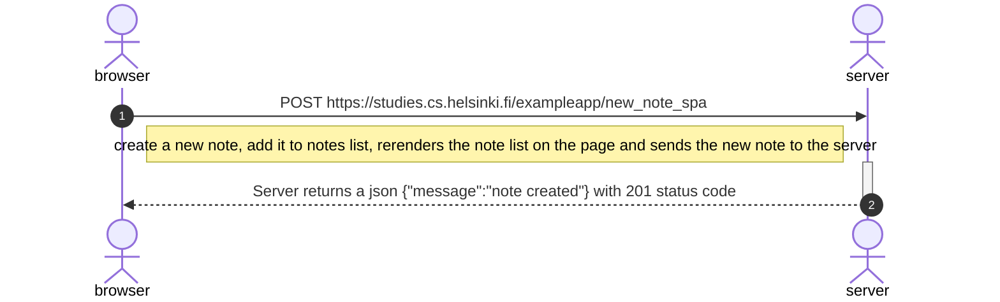
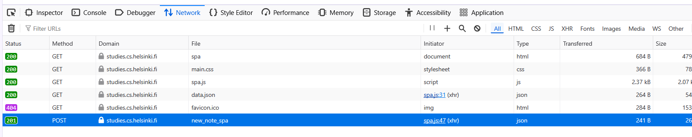

```mermaid
sequenceDiagram
    autonumber
    actor browser
    actor server

    browser->>server: POST https://studies.cs.helsinki.fi/exampleapp/new_note_spa
    Note left of server: create a new note, add it to notes list, rerenders the note list on the page and sends the new note to the server
    activate server
    server-->>browser: Server returns a json {"message":"note created"} with 201 status code
    deactivate server
```

